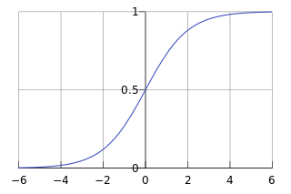
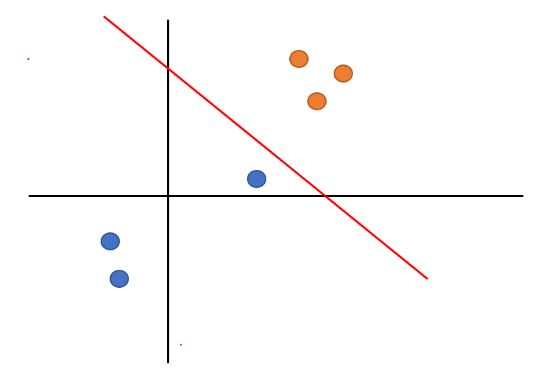
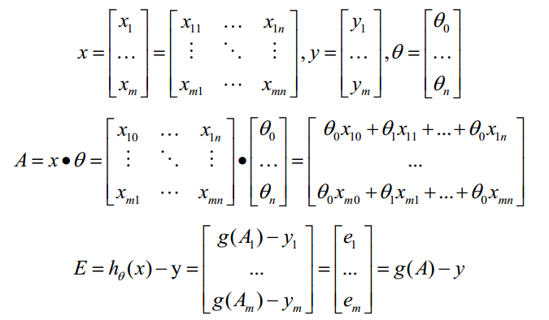

## Introduction

Logistic Regression is a generalized linear model mainly used in binary classification. It works as a classifier utilizing Logistic function (also named Sigmoid function).

Sigmoid function pocesses a pretty S-curve.

 Logistic Regression Classifier aims at learning a binary classification model from the features of training data. 

 

The training process is to construct a prediction function with Logistic function and to make the loss iterate within each epoch.

 

## Derivation of the gradient

 

The logarithm of Loss function:

Then, we have the gradient:

 

## Vectorization Method
 

We encode and encrypt each $x_i$ into a ciphertext, calculated with the encrypted weight $[\theta_i]$ to get the loss.
Then update the weight:

