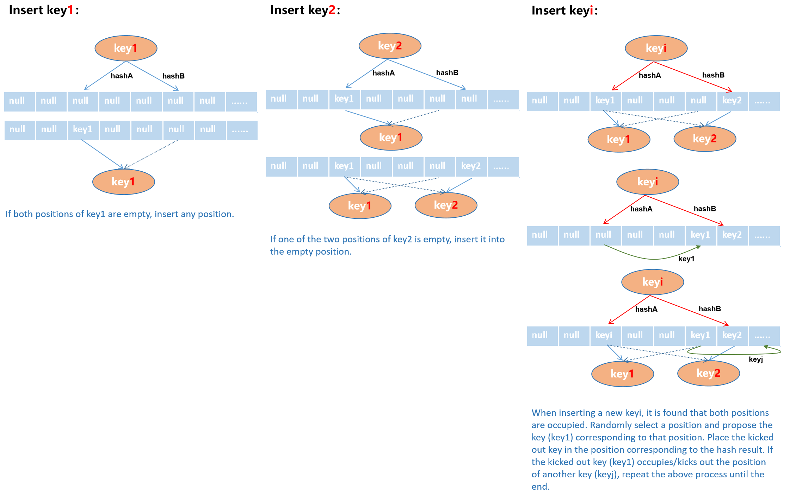

## Introduction

Private Set Intersection (PSI) is a cryptographic technique that allows two parties to find the common elements in their respective sets without revealing any other information about their sets to each other. This means they can identify what data they share in common, without disclosing any data that isn't shared. PSI is crucial in contexts where privacy and confidentiality are important, such as in secure data sharing, privacy-preserving data analysis, and in cybersecurity, enabling collaboration and data comparison without compromising sensitive information.
 
 
 

 
 

**Intersection of privacy sets based on Homomorphic Encryption**

We used two methods to enhance the security of the algorithm:
-Cuckoo hash
-OPRF

 

 
