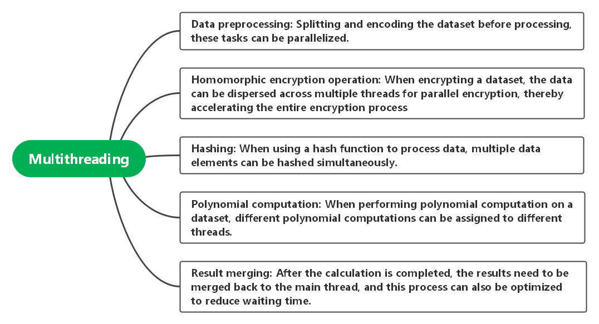

## Introduction

<div style="text-align: justify">

Private Set Intersection (PSI) is a cryptographic technique that allows two parties to find the common elements in their respective sets without revealing any other information about their sets to each other. This means they can identify what data they share in common, without disclosing any data that isn't shared. PSI is crucial in contexts where privacy and confidentiality are important, such as in secure data sharing, privacy-preserving data analysis, and in cybersecurity, enabling collaboration and data comparison without compromising sensitive information.
<br>
<br>
<br>


<style>
    img[alt="box"]{
        width:400px;
    }
</style> 

<br>
<br>

**Intersection of privacy sets based on Homomorphic Encryption:**


<style>
    img[alt="p2"]{
        width:600px;
    }
</style>

## Security reinforcement methods
We used two methods to enhance the security of the algorithm:
<br>
<ul>
  <li>Cuckoo hash</li>
  <li>OPRF</li>

</ul>

**Cuckoo hash**
<br>
Cuckoo hashing is a hashing technique that can efficiently solve conflict problems. In PSI, it can be used to construct data structures for efficient processing and searching of elements in a set.
<br>
<ol>
  <li>Hash table initialization:<ul><li>Each element in the dataset is hashed to one or more positions.</li><li>Each participant initializes two or more hash tables using the cuckoo hash algorithm.</li></ul></li>
  <li>Data insertion and search:<ul><li>When inserting data into a hash table, if a position is found to be occupied, the original element will be "squeezed out" and an attempt will be made to insert at the position defined by other hash functions.</li><li>This method can make the search operation very efficient, as each element has only a limited number of possible positions.</li></ul></li>

</ol>

<br>


<style>
    img[alt="p3"]{
        width:600px;
    }
</style>

<br>

**OPRF**
<br>


<style>
    img[alt="p4"]{
        width:600px;
    }
</style>

<br>

## Performance improvement and utilization of resource advantages
<br>


<style>
    img[alt="p5"]{
        width:600px;
    }
</style>

<br>

## Code

```
wget xxx
```